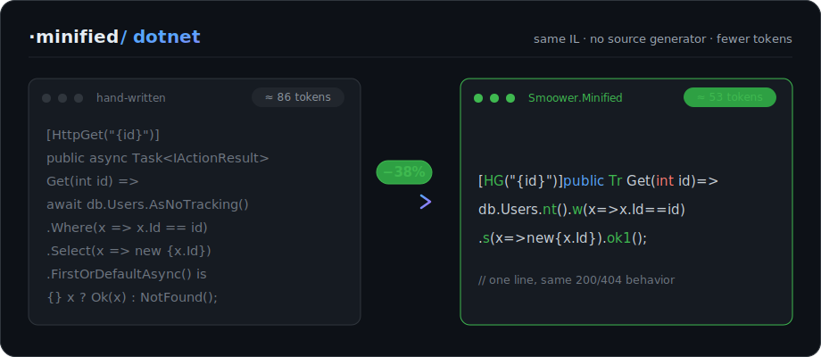

<div align="center"><pre>
███╗   ███╗██╗███╗   ██╗██╗███████╗██╗███████╗██████╗ 
████╗ ████║██║████╗  ██║██║██╔════╝██║██╔════╝██╔══██╗
██╔████╔██║██║██╔██╗ ██║██║█████╗  ██║█████╗  ██║  ██║
██║╚██╔╝██║██║██║╚██╗██║██║██╔══╝  ██║██╔══╝  ██║  ██║
██║ ╚═╝ ██║██║██║ ╚████║██║██║     ██║███████╗██████╔╝
╚═╝     ╚═╝╚═╝╚═╝  ╚═══╝╚═╝╚═╝     ╚═╝╚══════╝╚═════╝ 
              same .NET code · fewer tokens · no magic
</pre></div>

<p align="center"><strong>Your AI pays by the token. ASP.NET Core makes it pay a lot — Smoower.Minified makes it pay less.</strong></p>

<p align="center">part of the <code>·minified</code> family — <strong>dotnet</strong> today · react · vue · tooling next</p>

<p align="center">
  <a href="https://github.com/smoower/dotnet-minified/actions/workflows/ci.yml"></a>
  <a href="https://www.nuget.org/packages/Smoower.Minified.AspNetCore"></a>
  <a href="https://dotnet.microsoft.com"></a>
  <a href="LICENSE"></a>
</p>

<p align="center">
  <a href="https://smoower.github.io/dotnet-minified/">Docs</a> ·
  <a href="https://smoower.github.io/dotnet-minified/quickstart.html">Quickstart</a> ·
  <a href="https://smoower.github.io/dotnet-minified/compaction-levels.html">Compaction levels</a> ·
  <a href="https://smoower.github.io/dotnet-minified/cheat-sheet.html">Cheat sheet</a> ·
  <a href="https://smoower.github.io/dotnet-minified/economics.html">Does it pay off?</a>
</p>

<div align="center">
  
</div>

---

Smoower.Minified is a set of tiny C# libraries that shrink the boilerplate-heavy
parts of a .NET API (controllers, EF Core queries, DI, logging) into short,
stable forms. The alias layer (L1) is 100% ordinary C# — no transpiler, no magic,
same IL, fewer tokens. An opt-in `[Crud<>]` source generator and the deeper L2/L3
levels go further when you want them, always keeping the public contract intact.

It cuts the **output tokens** an AI emits for .NET code by roughly **10–25% across
a whole project**, and **25–45% in boilerplate-heavy controller files** — which
means faster generation, a smaller bill on metered billing, and more headroom in
the context window on subscription tools. It's ordinary C#, so none of this costs
you any runtime behavior.

📖 **Full documentation — getting started, compaction levels, the per-mapping
cheat sheet, and the economics: <https://smoower.github.io/dotnet-minified/>**

## Get started in seconds

```bash
# 1 — add the packages (ASP.NET Core backend set)
dotnet add package Smoower.Minified.AspNetCore
dotnet add package Smoower.Minified.EFCore

# 2 — drop the usings + aliases into a GlobalUsings.cs
#     (copy from samples/Smoower.Minified.SampleApi/GlobalUsings.cs)

# 3 — point your AI at the style
#     Claude Code → just ask it to "use Smoower.Minified"  (ships as a skill)
#     Copilot / Cursor / GPT → paste prompts/system-prompt.md
```

That's it — your next controller comes out compact. Full walkthrough (let your
AI wire it, or do it by hand) in the
**[Quickstart](https://smoower.github.io/dotnet-minified/quickstart.html)** and
**[Installation](https://smoower.github.io/dotnet-minified/installation.html)**
guides.

Here's the same controller action, hand-written and with Smoower.Minified —
identical behavior, identical compiled IL:

```csharp
[HttpGet("{id}")]
public async Task<IActionResult> Get(int id)
{
    var x = await _db.Users
        .AsNoTracking()
        .Where(u => u.Id == id)
        .Select(u => new { u.Id, u.Name, u.Email })
        .FirstOrDefaultAsync();
    return x == null ? NotFound() : Ok(x);
}
```

```csharp
[HG("{id}")]public Tr Get(int id)=>db.Users.nt().w(x=>x.Id==id).s(x=>new{x.Id,x.Name,x.Email}).ok1();
```

One line, same behavior. `ok1()` runs the query and returns `200` with the row,
or `404` if it's missing. Why this saves tokens is on
[How it works](https://smoower.github.io/dotnet-minified/how-it-works.html); every
mapping is on the [Cheat sheet](https://smoower.github.io/dotnet-minified/cheat-sheet.html).

## Compaction levels

Smoower.Minified is a dial, not a switch. Pick by how much you value
readable-on-disk vs raw token count — the Claude Code skill asks you which level
before it generates.

| Level | What it adds | Readable on disk? |
| --- | --- | --- |
| **L1 — Aliases** | smoower short handles + optional `[Crud<>]` generator | yes |
| **L2 — Mapped** | short domain names, long form pinned in `[JPN]`/`[Col]`/`global using` + a `names.map` | with tooling |
| **L3 — Max** | whitespace packed — every newline + indentation removed | tooling view |

On a real task-management API ([`samples/TodoApi`](samples/TodoApi)) the ladder
measured traditional → smoower → packed at **5049 → 4121 (~18%) → 3785 (~25%)**
Claude tokens. At every level the contract — routes, status codes, JSON/DB
*values* — is unchanged; only the in-code handle moves. Full detail on
[Compaction levels](https://smoower.github.io/dotnet-minified/compaction-levels.html).

## The packages

Pick only what you use. The data and web layers are split so a console worker can
take `EFCore` without dragging in ASP.NET Core.

| Package | What |
| --- | --- |
| `Smoower.Minified.Core` | guards (`nil`/`emp`/`none`) plus base aliases, zero framework deps |
| `Smoower.Minified.AspNetCore` | attributes, MVC aliases, result-fusing terminators |
| `Smoower.Minified.EFCore` | query + write helpers (async default, `S`-suffixed sync) |
| `Smoower.Minified.Http` | `HttpClient` JSON helpers |
| `Smoower.Minified.Redis` | StackExchange.Redis helpers |
| `Smoower.Minified.Logging` | `ILogger` helpers |
| `Smoower.Minified.Hosting` | DI registration helpers |
| `Smoower.Minified.Validation` | `MiniValidator<T>` + `req`/`rule`/`max`/`email`/`gt` over FluentValidation |
| `Smoower.Minified.Json` | `toJson`/`fromJson<T>` (System.Text.Json; Newtonsoft variant available) |
| `Smoower.Minified.Dapper` | `q`/`q1`/`ex`/`scalar` over `IDbConnection` |
| `Smoower.Minified.Identity` | short `UserManager`/`SignInManager`/`RoleManager` ops (`create`/`byEmail`/`checkPw`/`pwSignIn`) |
| `Smoower.Minified.Generators` | opt-in `[Crud<>]` source generator — expands a partial controller into full CRUD *(preview: in-repo, not yet on NuGet)* |

Full breakdown on [Libraries](https://smoower.github.io/dotnet-minified/libraries.html).

## The one rule: don't compact the contract

This changes how the code is *written*, never what it *does* at runtime. Keep
route templates, HTTP verbs, status codes, and DTO property/JSON names exactly as
your API requires. Shorten the code, not the contract.

## The minified family

`dotnet-minified` is the first of a family. The premise generalizes: anywhere an
AI assistant pays by the token to re-emit framework ceremony, a stable compact
dialect that keeps the contract pays for itself.

- **`dotnet-minified`** — ASP.NET Core / EF Core. Shipping today. *(this repo)*
- **`react-minified`, `vue-minified`, …** — the same idea for the front-end
  ceremony AI rewrites most. On the roadmap.
- **Tooling** — a CLI and editor integrations (VS Code) to apply, lint, and
  round-trip the compact style. Planned as a product layer on top of the
  open libraries. See [Tooling](https://smoower.github.io/dotnet-minified/tooling.html).

The libraries stay source-available and free; everything ships under the
**Smoower** brand for now. Want a runtime covered, or building one? Open an issue.

## Docs site

The browsable docs at <https://smoower.github.io/dotnet-minified/> are a static
site under [`docs/`](docs/), generated by [`docs/build.py`](docs/build.py), which
is the single source of truth for every mapping (re-run it after changing a
helper). It deploys automatically via
[`.github/workflows/pages.yml`](.github/workflows/pages.yml). Enable it once under
**Settings → Pages → Source: GitHub Actions**.
